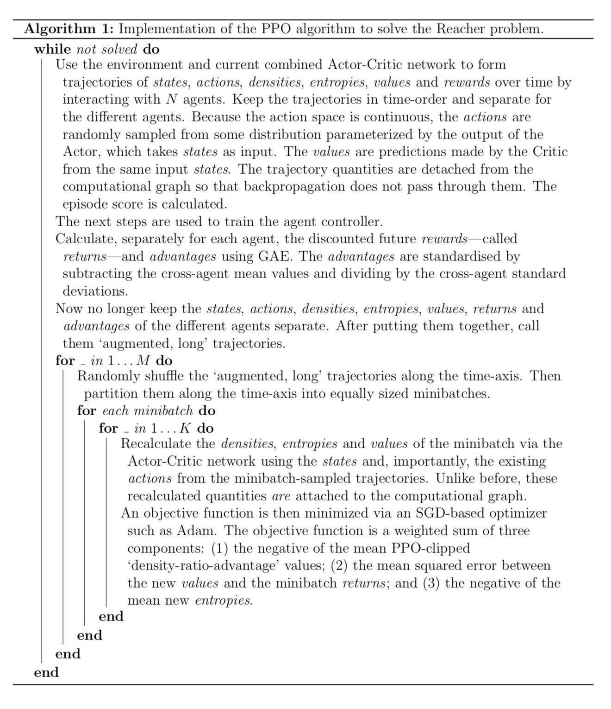
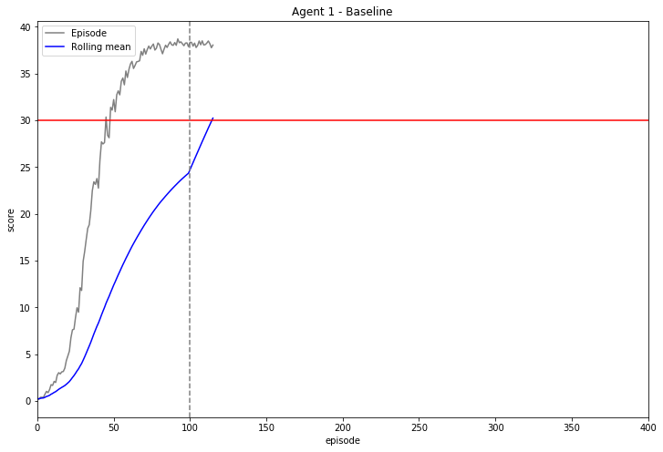
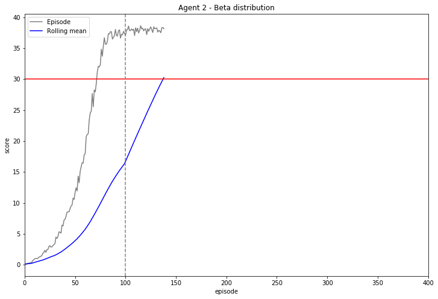
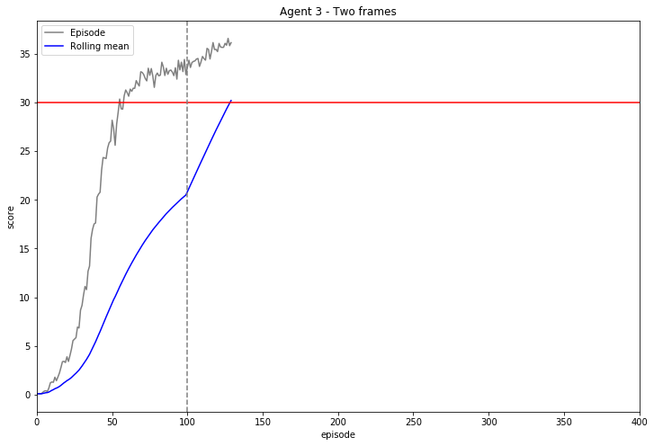

# REPORT
# Project 2: Continuous Control
## Udacity Deep Reinforcement Learning Nanodegree

## Introduction

In this report, details are given of a solution to `Project 2: Continuous Control` ("Reacher") of the Udacity Deep Reinforcement Learning Nanodegree.

## Project details

_This section has been copied from the README file._

_(Udacity)_

The goal of the project is to use Deep Reinforcement Learning to teach the controller of an agent how to track a moving target (see above). The experiences of twenty independent agents are available for training the controller. Each agent has two double-jointed arms. The environment is driven by the [Unity Machine Learning Agents Toolkit](https://github.com/Unity-Technologies/ml-agents).

The state space is 33-dimensional, representing quantities such as the position, rotation, velocity and angular velocities of the arms. The action space is four-dimensional, with all values in the interval $[-1, 1]$. These values represent the torque to be applied to the two joints. For each step that an agent's hand is in the target location, a reward of 0.1 is given. Learning is episodic, and each episode always contains exactly 1001 steps.

For this project, training of an agent controller is considered to be successful once the average score over all twenty agents over the preceding 100 episodes is at least 30. Within an episode, an agent's score is taken to be the sum of the rewards that that agent has received over the 1001 time-steps. The fewer episodes that are required to be successful, the better.

## Approach

The approach that has been followed is based on Proximal Policy Optimization (PPO). The full implementation can be found in the `src` directory while Algorithm 1 below gives a high-level overview. The implementation was inspired by the original [PPO](https://arxiv.org/abs/1707.06347v2) paper, the original paper on [Generalized Advantage Estimation (GAE)](https://arxiv.org/abs/1506.02438), and in part by the implementation of [Shangtong Zhang](https://github.com/ShangtongZhang/DeepRL). An Actor-Critic approach is followed, with the Critic predicting the discounted returns.

As a baseline, independent Normal distributions are used when the Actor generates actions. However, in the case of the Reacher problem, the action space is bounded between -1 and 1 in each dimension. Since the Normal distribution is unbounded, this requires some care. By using a final $\tanh$ activation function, the means are bounded between -1 and 1. In the present implementation, no bound is placed on the standard deviations. However, to prevent them from exploding, they are given a starting value of 1 each, and the entropy component of the objective function is given a zero weighting.

It is also possible to explicitly incorporate clipping of the actions so that clipping is taken into account during backpropagation. See [here](https://arxiv.org/abs/1802.07564) for a thorough discussion of the pros and cons of both explicit and implicit clipping.

Alternatively, instead of the Normal distribution, the Beta distribution can be used. Beta distributions have domain [0, 1], which can be easily translated to the required interval [-1, 1]. See [here](http://proceedings.mlr.press/v70/chou17a/chou17a.pdf) for full details on this approach.

## Agent Controllers

Three agent controllers were trained. Agent Controller 1 serves as the baseline. It samples actions from the Normal distribution. Agent Controller 2 is similar to Agent Controller 1 except that its actions are sampled from the Beta distribution. Finally, Agent Controller 3 is again similar to Agent Controller 1. However, at each time-step, Agent Controller 3 has access to two time-steps' worth of state.

The following are the hyperparameters that were used for the three agent controllers. Note that no specific hyperparameter tuning was performed for Agent Controllers 2 and 3. Instead they inherit most of their hyperparameter values from Agent Controller 1. For full details, see `src/train.ipynb`.

### Agent Controller 1

| Hyperparameter | Value | Symbol | Description |
|--- |---	|--- |--- |
| agents_n | 20 | $N$ | The number of (independent) agents that are learnt from simultaneously. |
| frames_n | 1 |  | The number of "frames" (or time-steps) that are taken as input simultaneously. |
| state_size | 33 |  | The dimension of the state space. |
| action_size	| 4 |  | The dimension of the action space. |
| action_distribution | Normal  | | The distribution that is modelled and from which actions are subsequently sampled. |
| hidden\_layer_size | 128 |  | For all networks, the number of nodes to use in a single hidden layer. |
| sgd_epochs | 16  | $M$ | Per episode, the number of training epochs that are performed. One epoch consists of an iteration through all minibatches. |
| minibatch_size | 4096  | |The number of experiences, out-of-sequence, from all agents, that are used at a time for stochastic gradient descient (SGD). |
| sgd\_inner_iterations | 1 | $K$  | For a given minibatch, the number of times SGD is applied repeatedly at a time. |
| gamma | 0.99 |  | The discounting factor to apply per time-step for rewards. |
| gae_lambda | 0.95 || The Generalized Advantage Estimator's (GAE) "lambda" parameter. |
| epsilon_start | 0.2 | | The starting value of the PPO clipping parameter, "epsilon". |
| epsilon\_update_factor | 1.0 | | The factor by which "epsilon" changes every episode. |
| objective\_weight\_critic_start | 0.5 | | The starting value of the weight in the final objective given to the Critic. |
| objective\_weight\_critic\_update\_factor | 1.0 | | The factor by which the weight in the final objective of the Critic changes every episode. |
| objective\_weight\_entropy\_start | 0.0 | | The starting value of the weight in the final objective given to the entropy bonus. |
| objective\_weight\_entropy\_update\_factor | 1.0 | | The factor by which the weight in the final objective of the entropy bounus changes per episode. |
| learning_rate | 3e-4 | | The learning rate used by the Adam optimizer (jointly for the Actor and Critic networks). |
| learning_eps | 1e-5 | | A parameter corresponding to the Adam optimizer's "eps" parameter. |

### Agent Controller 2
(Bold values indicate those that differ from Agent Controller 1.)

| Hyperparameter | Value |
|--- |---	|
| agents_n | 20 |
| frames_n | 1 |
| state_size | 33 |
| action_size	| 4 |
| action_distribution | **Beta**  |
| hidden\_layer_size | 128 |
| sgd_epochs | 16  |
| minibatch_size | 4096  |
| sgd\_inner_iterations | 1 |
| gamma | 0.99 |
| gae_lambda | 0.95 |
| epsilon_start | 0.2 |
| epsilon\_update_factor | 1.0 |
| objective\_weight\_critic_start | 0.5 |
| objective\_weight\_critic\_update\_factor | 1.0 |
| objective\_weight\_entropy\_start | **0.001** |
| objective_\weight\_entropy\_update\_factor | 1.0 |
| learning_rate | 3e-4 |
| learning_eps | 1e-5 |

### Agent Controller 3
(Bold values indicate those that differ from Agent Controller 1.)

| Hyperparameter | Value |
|--- |---	|
| agents_n | 20 |
| frames_n | **2** |
| state_size | 33 |
| action_size	| 4 |
| action_distribution | Normal |
| hidden\_layer_size | **256** |
| sgd_epochs | 16  |
| minibatch_size | 4096  |
| sgd\_inner_iterations | 1 |
| gamma | 0.99 |
| gae_lambda | 0.95 |
| epsilon_start | 0.2 |
| epsilon\_update_factor | 1.0 |
| objective\_weight\_critic_start | 0.5 |
| objective\_weight\_critic\_update\_factor | 1.0 |
| objective\_weight\_entropy\_start | 0 |
| objective\_weight\_entropy\_update\_factor | 1.0 |
| learning_rate | 3e-4 |
| learning_eps | 1e-5 |

## Results

For this project, each agent controller was trained only once. In its single training, Agent Controller 1 was able to solve the problem over episodes 17 to 116. 

Similarly, Agent Controller 2 managed to solve the problem over episodes 40 to 139. 

Finally, in its single training, Agent Controller 3 solved the problem over episodes 31 to 130.

A proper, general comparison between the three agent controllers would require repeating the training of each multiple times, and then comparing the results statistically. It would also involve spending time specifically tuning the hyperparameters for Agent Controllers 2 and 3.

At any rate, based only on a single training, for the Reacher problem it appears as if using the Beta distribution instead of the Normal distribution, or using two 'frames' instead of one, does not lead to quicker training.

## Ideas for future work

* Implement [Distributed PPO (DPPO)](https://arxiv.org/abs/1707.02286) to make true distributed learning with PPO possible.
* Try to solve the problem with [SAC](https://arxiv.org/abs/1812.05905).
* Compare the performance of PPO with [DDPG](https://arxiv.org/abs/1509.02971).

## Conclusion

PPO is capable of solving the 20-agent Reacher problem in 116 episodes or fewer.
